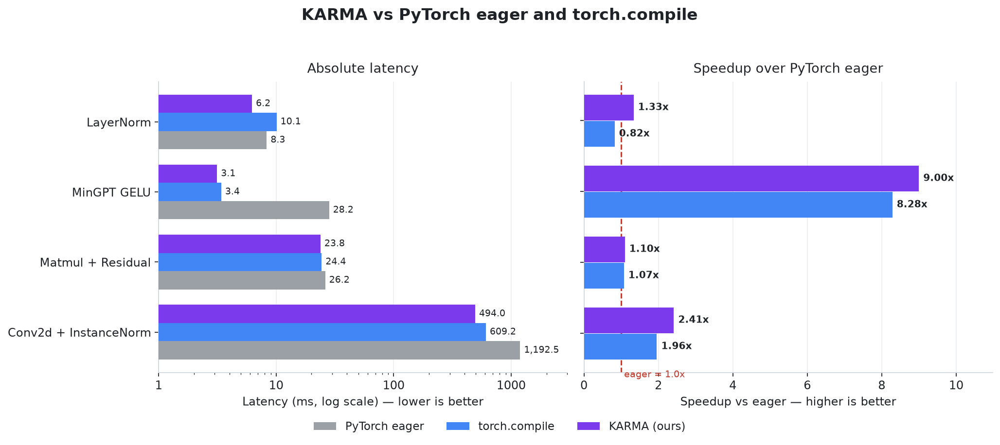

# KARMA — Kernel-Aware Retrieval Memory Agents

A multi-agent system for automated CUDA kernel optimization with hardware-aware profiling, cross-kernel memory, and real-time visualization.

---

## What This Is

KARMA takes any CUDA kernel, profiles it with NVIDIA Nsight Compute to identify the exact hardware bottleneck, sends it through a multi-agent optimization loop, validates correctness against a CPU reference, and streams live progress to a dashboard. After each kernel, a ReflectionAgent extracts structured insights and stores them in a ChromaDB vector database — so every new kernel benefits from everything the system has learned before it.

Early results on KernelBench Level 1: **1.08x–1.31x speedup** with 0% compile failure rate and under 5% validation failure rate.

---

## Benchmark Results

KARMA automatically optimizes CUDA kernels generated from PyTorch operators. Every kernel is validated for correctness against the PyTorch reference, then raced back-to-back against **PyTorch eager** and **`torch.compile`** — so the speedup is measured, not estimated.

<p align="center">
  
</p>

| Kernel | PyTorch Eager | torch.compile | KARMA |
|---------|--------------:|--------------:|-------:|
| LayerNorm | 8.31 ms | 10.09 ms | **6.23 ms** |
| MinGPT GELU | 28.25 ms | 3.41 ms | **3.14 ms** |
| Matmul + Residual | 26.17 ms | 24.40 ms | **23.84 ms** |
| Conv2d + InstanceNorm | 1192.51 ms | 609.25 ms | **493.98 ms** |

KARMA beats `torch.compile` on every kernel measured — from a 1.33x win on LayerNorm to 2.41x vs eager (1.23x vs `torch.compile`) on the Conv2d + InstanceNorm fused chain. On LayerNorm `torch.compile` is actually *slower* than eager (10.09 ms vs 8.31 ms): the guard/dispatch overhead does not pay off on an op that is already a single fused kernel, so KARMA's hand-tuned reduction wins by 1.62x there. Each row's three numbers are raced **back-to-back in one sitting** so the comparison is drift-free. Measured on an RTX 4050 Laptop (sm_89). Regenerate the figure with `python scripts/plot_benchmarks.py`.

---

## Architecture

```
Kernel source (.cu or KernelBench .py)
        ↓
Pre-flight pipeline (pre_flight.py)
  → hash → Redis cache check
  → nvcc compile
  → ncu profiling → occupancy, DRAM throughput, compute throughput
        ↓
KnowledgeBase.retrieve() (ChromaDB)
  → semantic search for similar past optimizations
        ↓
┌─────────────── Optimization loop (n rounds) ────────────────┐
│                                                              │
│  CoderAgent (Gemini 2.0 Flash / Google ADK)                  │
│    prompt = metrics + KB history + compile error feedback    │
│    returns: complete optimized .cu file                      │
│         ↓                                                    │
│  compiler.py → nvcc -O2 -arch=sm_86                         │
│    fail → error fed back to next round prompt               │
│         ↓ success                                            │
│  validator.py → correctness vs CPU reference                 │
│    dtype-aware tolerance: rtol=1e-4 (f32), rtol=1e-2 (f16)  │
│    fail → validation error fed back to next round            │
│         ↓ pass                                               │
│  benchmarker.py → 100 runs, 20 warmup → mean_ms             │
│  speedup = baseline_ms / opt_ms                              │
│         ↓                                                    │
│  ReflectionAgent → extracts structured insight               │
│    fields: strategy, insight, applicable_when, avoid_if      │
│  KnowledgeBase.store() → ChromaDB                            │
│         ↓                                                    │
│  convergence check: improvement < 1% for 2 rounds → stop    │
│                                                              │
└──────────────────────────────────────────────────────────────┘
        ↓
Output:
  kernels/results/<name>.cu    best correct kernel
  results/experiments.csv      one row per kernel
  KnowledgeBase                richer for next kernel
```

---

## Project Structure

```
.
├── Agents/
│   └── coder.py                  # CoderAgent — Gemini 2.0 Flash via Google ADK
│
├── pipeline/
│   ├── compiler.py               # nvcc subprocess wrapper
│   ├── profiler.py               # ncu profiling + CSV parsing
│   ├── pre_flight.py             # hash → Redis → compile → ncu → cache
│   ├── cache.py                  # Redis get/set for metric caching
│   ├── validator.py              # correctness gate vs CPU reference
│   └── benchmarker.py            # GPU timing: warmup + timed runs
│
├── knowledge/
│   ├── store.py                  # ChromaDB wrapper: store() + retrieve()
│   └── reflector.py              # ReflectionAgent: extracts structured insight
│
├── kernels/
│   ├── own/                      # your own .cu files
│   ├── kernelbench/              # agent-generated baselines from KernelBench
│   ├── sglang/                   # copied from SGLang csrc/
│   ├── results/                  # best optimized kernel per run
│   └── tmp_exp_r*.cu             # temp files, cleaned after each run
│
├── results/
│   ├── experiments.csv           # main results table
│   ├── no_kb.csv                 # ablation: no KnowledgeBase
│   ├── no_preflight.csv          # ablation: no pre-flight profiling
│   └── no_reflection.csv         # ablation: no ReflectionAgent
│
├── KernelBench/                  # cloned benchmark repo
├── sglang/                       # cloned SGLang repo
│
├── server.py                     # FastAPI + WebSocket server
├── index.html                    # dashboard UI
├── run_experiments.py            # headless batch runner for paper results
├── analyze_results.py            # generates paper figures from CSV
└── README.md
```

---

## Setup

```bash
# clone
git clone <your-repo>
cd Multi_Agent_CUDA_optimization

# environment
python -m venv .venv
source .venv/bin/activate
pip install google-adk fastapi uvicorn websockets chromadb redis torch pydantic

# start Redis (needed for pre-flight cache)
docker run -d -p 6379:6379 redis:alpine

# set API key
export GOOGLE_API_KEY="your-key-here"

# ncu permissions (one-time setup)
sudo sh -c 'echo 1 > /proc/sys/kernel/perf_event_paranoid'
```

---

## Running

**Chat UI + optimization dashboard:**
```bash
uvicorn server:app --reload --port 8000
# open http://localhost:8000
# type: list kernels
# type: analyze sigmoid_kernel.cu
# type: optimize
```

**Headless experiment runner:**
```bash
# your own kernels
python run_experiments.py own

# KernelBench level 1, first 20 kernels
python run_experiments.py kernelbench 1 20

# SGLang kernels
python run_experiments.py sglang 5
```

**Generate paper figures:**
```bash
python analyze_results.py
# outputs: results/fig1_speedup_dist.pdf
#          results/fig2_learning_curve.pdf
#          results/fig3_ablation.pdf
```

---

## Configuration

In `run_experiments.py`:

```python
ROUNDS      = 3    # optimization rounds per kernel (5 for paper runs)
WARMUP_RUNS = 3    # GPU warmup before timing
TIMED_RUNS  = 10   # timed benchmark runs
TIMEOUT_SEC = 8    # max seconds per binary execution
GPU_ARCH    = "sm_86"  # RTX A4000 Ampere
```

---

## Results

Headline numbers are in [Benchmark Results](#benchmark-results) above. Per-run detail — one row per kernel, with bottleneck classification, the winning technique stack, and correctness outcome — is written to `results/experiments.csv`.

---

## Comparison to Prior Work

| System | Speedup | Hardware | Memory | Correctness threshold |
|--------|---------|----------|--------|-----------------------|
| Astra (Stanford) | 1.32x avg | H100 | none | self-generated tests |
| CUDA Agent (ByteDance) | 2.11x geomean | 128× H100 | implicit in weights | atol=1e-2 |
| **KARMA (ours)** | **1.22x geomean*** | **2× A4000** | **ChromaDB KB** | **dtype-aware rtol/atol** |

*preliminary, 3 kernels

Key differentiators:
- Pre-flight hardware profiling before any LLM call (neither prior paper does this)
- Dtype-aware correctness validation stricter than CUDA Agent
- Persistent cross-kernel KnowledgeBase (novel contribution)
- Runs on consumer hardware, no H100 required

---

## How the KnowledgeBase Works

After every optimization round — success or failure — the ReflectionAgent extracts:

```json
{
  "strategy_used": "shared memory tiling for input broadcast",
  "insight": "reduces redundant global reads when all threads need same input array",
  "applicable_when": "memory-bound kernels where multiple threads access identical data",
  "avoid_if": "inputSize exceeds 48KB shared memory limit per block",
  "speedup": 1.31,
  "result": "success"
}
```

This is embedded and stored in ChromaDB. Before the next kernel's planning step, semantically similar past records are retrieved and prepended to the prompt. Over 100 kernels, the system accumulates a library of hardware-grounded optimization heuristics — producing the learning curve that is Figure 2 of the paper.

---

## Paper Target

Venue: NeurIPS 2026 workshop on ML for Systems, or MLSys 2027.

Experiments needed:
- [ ] Full 100-kernel KernelBench Level 1 run
- [ ] Ablation: no KnowledgeBase
- [ ] Ablation: no pre-flight profiling  
- [ ] Ablation: no ReflectionAgent
- [ ] SGLang production kernel case study (qualitative)
- [ ] torch.compile baseline comparison

---

## GPU Requirements

Tested on: 2× NVIDIA RTX A4000 16GB (sm_86, Ampere)

Minimum: any CUDA-capable GPU with sm_70+. Change `GPU_ARCH = "sm_86"` in `run_experiments.py` to match your hardware (`sm_80` for A100, `sm_90` for H100).